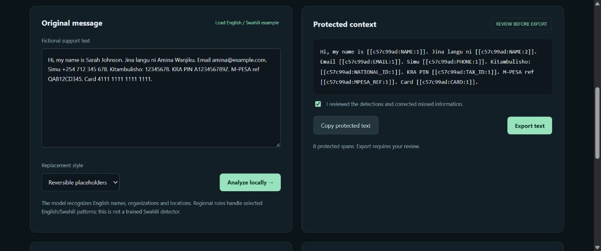
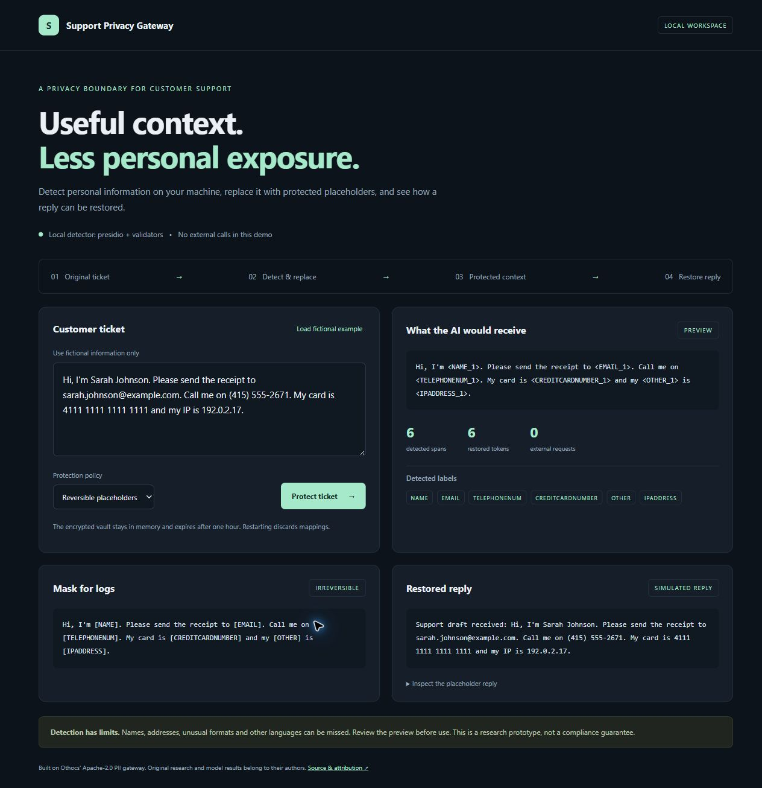
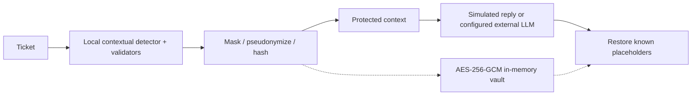

# SupportPrivacyGateway

## Local protection studio: TypeScript + Rust

Protect support text, PDFs and screenshots on your own device, then review the result before exporting. The new studio is an independent implementation of the gateway concept with a browser-local detector, a native Rust gateway, regional English/Swahili rules and irreversible raster document redaction.

The original Python project remains below for comparison. Othmane Menkor's [QLoRA-PII-Redaction](https://github.com/Othocs/QLoRA-PII-Redaction) inspired the gateway flow; its research and training results are his. These additions do not reproduce his unpublished trained model or claim his benchmark scores.



### Start the new studio

On Windows, install Node 24+ and stable Rust, then run:

```powershell
./Start-Native.ps1
```

First setup downloads the pinned English BERT NER model, English/Swahili OCR data and local runtimes, then builds the studio. Later launches work offline. The server binds only to `127.0.0.1:8766`. Open that address in Brave. No API key is needed. A prepared Windows bundle can also run from `Start.cmd` without Node, Python or Rust.

On other platforms:

```sh
cd browser
npm ci --ignore-scripts
npm run assets
npm run build
cd ../native
cargo build --release --locked
./target/release/support-privacy-native serve --assets ../browser/dist
```

### What works

| Capability | Implementation | Boundary |
| --- | --- | --- |
| Contextual detection | Quantized BERT NER in a browser worker, merged with validators | English model, no raw text sent to a model service |
| Regional patterns | Contextual names, Kenyan IDs, KRA PINs, M-PESA references, selected Ugandan NIN formats, English/Swahili digit words | Pattern coverage, not a trained Swahili model |
| Review | Remove false positives, add missed text or drag document rectangles | Export approval resets after edits |
| Replacement | Masks, reversible placeholders, keyed hashes | Browser AES-GCM vault with separate HMAC key; 30-minute session |
| Native gateway | Rust CLI and loopback JSON API with AES-GCM scoped restoration | Native detector uses rules, no model or cloud forwarding |
| Documents | Local PDF rendering and English/Swahili OCR, per-page review | New PNGs or image-only PDFs, original text/attachments/metadata discarded |

PDF exports lose search, selectable text, links and accessibility structure. OCR and detectors can miss private information. English NER can misclassify Swahili words. Rules-only mode misses unlabelled names and addresses. Use fictional data while evaluating; this is a prototype, not a guarantee of anonymization or compliance. Session clearing discards application references, not a forensic secure-memory wipe. Native API mappings expire after 30 minutes or server exit.

See [architecture and behavior](docs/POLYGLOT.md), [evaluation evidence](docs/POLYGLOT_VERIFICATION.md) and [fictional fixtures](fixtures/README.md).

### Checks

```sh
cd browser
npm test
npm run build
npm run benchmark
cd ../native
cargo fmt --check
cargo clippy --locked --all-targets -- -D warnings
cargo test --locked
cargo run --release -- benchmark
```

`npm run dev` builds and serves a browser-only preview on port 8767. Re-run it after edits. Native mode requires the Rust server. Asset preparation makes network requests; runtime detection uses only locally served assets. Model revision and download hashes are in `browser/asset-manifest.json`; package versions are pinned by lockfiles.

## Existing Python dashboard

A local privacy gateway for customer-support text, with a dashboard showing detection, protected context and reversible replies.

**An attributed extension of [Othocs/QLoRA-PII-Redaction](https://github.com/Othocs/QLoRA-PII-Redaction), not a newly trained model.** The Apache-2.0 gateway, training code and original research retain their authorship. Upstream commit: `f4a555012fefe72494b05fe407ade29843e1a5b8`. Original documentation is preserved in [UPSTREAM_README.md](UPSTREAM_README.md), [NOTICE](NOTICE), [MODEL_CARD.md](MODEL_CARD.md) and [the report](docs/REPORT.md).



## Run on Windows

Install [uv](https://docs.astral.sh/uv/getting-started/installation/), then run:

```powershell
./Start-Local.ps1
```

Open http://127.0.0.1:8765 in Brave or any browser. The launcher installs Python 3.12 and dependencies into the project environment. The default detector runs **Presidio + spaCy locally**, merged with validators for card numbers (Luhn), IBANs (mod-97), phone numbers, email and IP addresses. No external AI service is contacted by the dashboard. Use fictional examples.

Other platforms:

```sh
uv sync --extra serve --extra presidio
PII_DETECTOR=presidio PII_SPACY_MODEL=en_core_web_sm uv run --no-sync uvicorn --factory pii_gateway.lab:create_lab --host 127.0.0.1 --port 8765 --no-access-log
```

For a limited demo: `./Start-Local.ps1 -ValidatorsOnly`. This mode can miss names and addresses and cannot use the real proxy.

## Added in this extension

- Dashboard with editable fictional tickets, protected payload preview, masked log text, detected labels and simulated reply restoration.
- Three policies: masks, reversible placeholders and keyed hashes.
- One-hour encrypted in-memory demo vault, fresh keys each launch and no saved ticket history.
- Local Host/Origin checks, per-session request token, no-store responses and content security policy.
- Presidio and GLiNER available as contextual gateway detector choices; invalid configuration fails at startup.
- Real proxy rejects validators-only detection and policies with `keep` actions. Its default policy pseudonymizes every detected label.
- Remote detection requires explicit opt-in because it sends raw text to that detector server.
- User-controlled tenant/conversation metadata removed from application logs; invalid policy errors do not echo the submitted name.
- Regression tests for local boundaries, round trips, outbound blocking and metadata leaks.



## API and real external LLM integration

The dashboard uses an in-process simulated reply. Run the separate API for a real integration:

```sh
uv run --no-sync uvicorn --factory pii_gateway.api:create_app --host 127.0.0.1 --port 8000 --no-access-log
```

Configure `PII_DETECTOR=presidio`, `PII_SPACY_MODEL=en_core_web_sm`, a base64 random 32-byte `PII_VAULT_KEY`, strong independent `PII_API_KEY` and `PII_RESTORE_KEY`, and `PII_UPSTREAM_URL`, `PII_UPSTREAM_KEY`, `PII_UPSTREAM_MODEL`. Secrets belong in your environment and must not be committed. The upstream URL includes the API version, e.g. `https://provider.example/v1`. Authenticate with `X-API-Key`; restoration requires `X-Restore-Key`.

- `POST /redact`: protected text and detected offsets, with no original values in entity metadata.
- `POST /restore`: recover known conversation-bound placeholders.
- `POST /proxy`: redact all messages, call an OpenAI-compatible chat API, then restore recognized placeholders. Use `private` (default), `strict` or `hashed`.
- `GET /health`: detector and vault availability. `/docs`: API schema.

No paid provider was contacted during development. Tests inspect outbound payloads using a mock transport. Deployment needs authenticated identity-to-tenant binding, TLS, rate limits, retention controls and review of access to restored data. Caller-supplied tenant names are scoping inputs, not authorization. Keep this prototype on loopback.

## Model training and evaluation

The source project's M5 QLoRA adapter was not published. This build uses a local baseline detector, **not M5**, and makes no claim to reproduce the author's accuracy. The Qwen3-1.7B recipe is retained in [training/train_lora.py](training/train_lora.py), [configs](configs) and [the model card](MODEL_CARD.md). Training requires separately sourced licensed datasets and GPU compute; it was not performed here.

```sh
uv sync --extra serve --extra presidio --extra data
uv run --no-sync pytest -q
uv run --no-sync python -m eval.run_eval --systems presidio --testsets fixture --spacy-model en_core_web_sm --out work/local-evaluation
```

See [VALIDATION.md](VALIDATION.md) for this build's checks. Files under `results/` are upstream research, not measurements of this extension. The tiny fixture is a smoke check, not a production accuracy benchmark.

## Limitations

Detection can miss personal information, especially names, addresses, spoken numbers, unusual formats and non-English text. Replacing detected spans does not guarantee anonymization: remaining context can identify someone. The dashboard restores and displays fictional values intentionally. Real-data use needs an independent threat review and representative evaluation.

The vault is in memory: restart/expiry loses mappings; use one worker. Unknown tokens remain unchanged. Policies load from the source checkout, so run from the repository instead of treating the wheel as a standalone deployment.

## Attribution and license

Gateway, training and research: Othmane Menkor / Othocs, Apache-2.0. This extension adds the dashboard, Windows launcher and safeguards above. See [LICENSE](LICENSE) and [NOTICE](NOTICE). Inspired by [this X thread](https://x.com/othocs/status/2106417355257528818).
