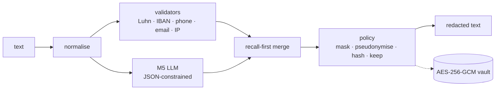

<p align="center">
  
</p>

<p align="center">
  <a href="https://huggingface.co/spaces/Othocs/pii-gateway-demo"></a>
  <a href="https://github.com/Othocs/QLoRA-PII-Redaction/actions/workflows/ci.yml"></a>
  <a href="LICENSE"></a>
  
  <a href="MODEL_CARD.md"></a>
</p>

<p align="center">
  <b><a href="https://huggingface.co/spaces/Othocs/pii-gateway-demo">Try the live demo</a></b> ·
  <b><a href="docs/REPORT.md">Read the report</a></b> ·
  <b><a href="MODEL_CARD.md">Model card</a></b> ·
  <b><a href="docs/ARCHITECTURE.md">Architecture</a></b>
</p>

A self-hosted gateway that finds personal data in English customer-support text and masks or pseudonymises it before the text is logged, analysed or sent to an external LLM. The detector is **M5**, Qwen3-1.7B fine-tuned with QLoRA for about $1 per run, backed by deterministic validators. It was benchmarked blind against Presidio, GLiNER-PII and OpenMed's privacy filter on seven test sets, including real human chats.

> **Status: concluded (October 2026).** Research write-up, gateway (FastAPI `/redact`, `/restore`, `/proxy`), CPU and GPU Docker images, and a public hosted demo. Total compute cost: about **$21.30**.

## Contents

- [Live demo](#live-demo)
- [What it does](#what-it-does)
- [Results](#results)
- [How we got there](#how-we-got-there)
- [How it works](#how-it-works)
- [Quickstart](#quickstart)
- [Documentation](#documentation)
- [Scope and limitations](#scope-and-limitations)
- [Repository layout](#repository-layout)
- [License and citation](#license-and-citation)

## Live demo

<p align="center">
  <a href="https://huggingface.co/spaces/Othocs/pii-gateway-demo"></a>
</p>

**[huggingface.co/spaces/Othocs/pii-gateway-demo](https://huggingface.co/spaces/Othocs/pii-gateway-demo)**: paste a support message and see what is found and how each value is masked, pseudonymised or kept. The page runs the real pipeline: validators on the Space's CPU, and M5 on a RunPod Serverless GPU that scales to zero.
- **First request:** after a quiet period it takes a few minutes while a GPU starts; after that, about 1–2 s per message.
- **Data:** use fictional data only. How it is hosted, its cost and its guardrails are in [`docs/DEMO.md`](docs/DEMO.md).

## What it does

<p align="center">
  
</p>

The example is a real M5 output on a held-out test message. All six values are found with exact boundaries, including a phone number spelled out in words, and "Callback after 2" is left alone. Policies decide what happens to each label:

| Policy | Names, contact details, IDs | City, age | Use |
| --- | --- | --- | --- |
| `support` | masked: `[GIVENNAME]` | city kept | agents and logs |
| `analytics` | pseudonymised: `<GIVENNAME_1>`, reversible through the vault | kept | analytics, and `/proxy` to external LLMs |
| `strict` | masked | masked | anything leaving the trust boundary |

## Results

<p align="center">
  
</p>

**Leakage** is the share of gold PII characters left unmasked (lower is better). M5 is averaged over 3 seeds, with 95% CIs from 1,000 document resamples, and each test set was scored once. Over-redaction (%) is in parentheses.

| Test set | Status for M5 | M5 | M5 + validators (gateway) | OpenMed | GLiNER-PII | Presidio |
| --- | --- | --- | --- | --- | --- | --- |
| Support desk (300, LLM-drafted) | unseen | **1.70** [0.82, 2.78] (5.8) | **1.25** | 3.54 (16.1) | 8.11 (23.2) | 18.91 (23.1) |
| TAB (127 real court cases) | unseen | 15.91 [13.92, 18.42] (5.2) | 15.87 | 14.91 (6.8) | 19.29 (17.6) | **11.23** (34.1) |
| **ABCD (1,002 real human chats)** | unseen | 2.55 [2.04, 3.15] (48.4) | 2.34 | 0.73 (42.5) | **0.26** (32.4) | 8.76 (59.6) |
| OpenPII held-out region (2,000) | unseen | **0.70** [0.60, 0.82] (0.6) | 0.66 | 0.80 (1.4) | 6.31 (5.7) | 35.67 (19.0) |
| OpenPII test (5,000) | in-dist. | 0.60 [0.54, 0.69] (0.5) | 0.55 | not run | not run | not run |
| Nemotron-PII test (3,000) | in-dist. | 2.64 [2.25, 3.09] (3.5) | 2.41 | **1.33** (4.2) | 5.02 (11.9) | 12.87 (31.6) |
| Gretel EN test (1,000) | in-dist. | **11.43** [10.13, 12.83] (9.9) | 11.24 | 29.23 (34.4) | 25.51 (35.7) | 29.05 (58.5) |

**What the evidence supports:**
- **Structured and synthetic text: M5 leads or ties.** It beats every baseline on LLM-drafted support messages (−1.8 to −17.2 pt, CIs excluding 0) at a third of their over-redaction. It ties OpenMed on an unseen region, and beats the encoders by 14–18 pt on Gretel-style documents.
- **Real legal text: M5 is competitive, not best.** It ties OpenMed on TAB and beats GLiNER-PII. Presidio leaks less there, but 34% of what it masks isn't PII.
- **Real chats: M5 doesn't win.** On ABCD's human-typed customer-service chats, GLiNER-PII and OpenMed leak less (+2.3 and +1.8 pt). The support-desk advantage came from LLM-drafted test text and does not transfer. All of M5's training data is generated or templated, which is the most likely cause.
- **Data beats hyperparameters.** Learning rate over a 12× range, and rank 16 against 32, changed nothing measurable. A second and third data source, and 2k targeted messages, each moved results by 10–23 pt.
- **Single seeds vary.** On small conversational sets they differ by about 1.5 pt, so seed-averaged numbers are reported.
- **Live gateway:** on one A40, median 0.38 s and p95 1.08 s per support message.

<table>
  <tr>
    <td width="50%"><a href="docs/REPORT.md#46-final-coverage"></a></td>
    <td width="50%"><a href="docs/REPORT.md#42-training-data-week-3-ablation"></a></td>
  </tr>
  <tr>
    <td align="center"><b>Coverage:</b> M5 against the best baseline on every test set</td>
    <td align="center"><b>Data ablation:</b> what each training-data change did</td>
  </tr>
</table>

<details>
<summary><b>More figures:</b> hyperparameter search, the M5 gate, leakage by label</summary>

<br>

**Hyperparameters changed nothing measurable** ([report §4.3](docs/REPORT.md#43-hyperparameter-search-phases-13)):


**Targeted data passed the pre-registered gate** ([report §4.4](docs/REPORT.md#44-targeted-data-m5)):


**Where M5 still leaks, by label** ([report §5](docs/REPORT.md#5-results)):


</details>

All figures are regenerated from the saved results by `make figures` ([`eval/figures.py`](eval/figures.py)).

## How we got there

Every phase's decision rule was written down in [`DECISIONS.md`](results/sweeps/DECISIONS.md) before its runs. The final test sets were scored once per system, blind, with 3 seeds ([`EVALUATION.md`](docs/EVALUATION.md)). Corrections are logged in [`ERRATA.md`](results/ERRATA.md).

| Step | What changed | What it did | Report |
| --- | --- | --- | --- |
| **M0** | QLoRA on 10k English OpenPII examples | OpenPII dev leakage 45.2% (zero-shot) → 0.74%, but 40% on an unseen generator (Gretel) | [§4.1](docs/REPORT.md#41-first-model-and-baselines-weeks-13) |
| **M1** | Dropped the 12% of examples with noisy labels | Nothing measurable | [§4.2](docs/REPORT.md#42-training-data-week-3-ablation) |
| **M2–M3** | Added a second source (Nemotron-PII) | Gretel dev leakage 40% → 29%, over-redaction 51% → 31% | [§4.2](docs/REPORT.md#42-training-data-week-3-ablation) |
| **Phase 1** | Learning rate across a 12× range | Flat (28.7–29.8%); 4e-4 kept | [§4.3](docs/REPORT.md#43-hyperparameter-search-phases-13) |
| **M4** | Added a third source (Gretel EN) | Gretel dev leakage 29.1% → 17.3% | [§4.3](docs/REPORT.md#43-hyperparameter-search-phases-13) |
| **Phase 3** | LoRA rank 32 against 16 | Within noise; r=16 kept, r=64 not run | [§4.3](docs/REPORT.md#43-hyperparameter-search-phases-13) |
| **M5** | 2k targeted synthetic support messages (spoken numbers, titles, look-alikes) | Fresh hard-set leakage 27.7% → 4.6% (CI excludes 0) | [§4.4](docs/REPORT.md#44-targeted-data-m5) |
| **Phase 4** | Blind 3-seed evaluation against 3 baselines, then 4 more test sets including real chats (ABCD) | The results above | [§4.5](docs/REPORT.md#45-final-blind-evaluation-phase-4), [§4.6](docs/REPORT.md#46-final-coverage) |

## How it works



1. **Normalise:** NFKC, zero-width stripping and look-alike characters, with an offset map back to the original.
2. **Detect:** the validators only flag values that pass their check, such as Luhn for cards, so gift-card numbers aren't masked. M5 lists values as JSON, and code aligns them to exact spans.
3. **Merge:** anything either detector flags is redacted.
4. **Apply the policy:** per label, from YAML ([`configs/policy/`](configs/policy)).
5. **Pseudonymise:** pseudonyms are stored in an encrypted, scope-bound vault, so `/restore` and `/proxy` can put the values back.

| Fails closed | No values in logs | Encrypted vault | One outbound route |
| --- | --- | --- | --- |
| A detection error returns 503, never the input | Enforced by a canary test | AES-256-GCM, bound to tenant and conversation | `/proxy` only; the upstream sees redacted text |

Details: [`docs/ARCHITECTURE.md`](docs/ARCHITECTURE.md).

## Quickstart

```bash
make setup        # uv sync (data, presidio, gliner, serve, demo extras)
make test         # unit tests, no model downloads
make serve        # gateway on :8000, validators only (CPU)
```

```bash
curl -s localhost:8000/redact -H 'Content-Type: application/json' \
  -d '{"text": "Card 4111 1111 1111 1111, mail ann.lee@example.com", "policy": "support"}'
# {"redacted": "Card [CREDITCARDNUMBER], mail [EMAIL]", "entities": [...], ...}
```

<details>
<summary><b>Python client, pseudonymise and restore, and <code>/proxy</code></b></summary>

<br>

Pseudonymising and restoring need a vault key and a restore key:

```bash
export PII_VAULT_KEY=$(python -c "import os, base64; print(base64.b64encode(os.urandom(32)).decode())")
export PII_RESTORE_KEY=change-me
make serve
```

```python
import httpx

gw = httpx.Client(base_url="http://localhost:8000")

r = gw.post("/redact", json={"text": "Mail ann.lee@example.com", "policy": "analytics"}).json()
print(r["redacted"])  # Mail <EMAIL_1>
cid = r["conversation_id"]  # pseudonyms are scoped to this conversation

# Put the values back; /restore is disabled unless PII_RESTORE_KEY is set
gw.post(
    "/restore",
    json={"text": "Reply sent to <EMAIL_1>", "conversation_id": cid},
    headers={"X-Restore-Key": "change-me"},
).json()
# {"restored": "Reply sent to ann.lee@example.com", "tokens_restored": 1}
```

With `PII_UPSTREAM_URL` set to any OpenAI-compatible API, `/proxy` redacts every message, calls the LLM, and restores the pseudonyms in its reply. If detection fails, nothing is forwarded:

```bash
curl -s localhost:8000/proxy -H 'Content-Type: application/json' \
  -d '{"messages": [{"role": "user", "content": "Draft an apology to Priya Shah, order 88213409"}]}'
# with M5 as the detector, the upstream sees "<GIVENNAME_1> <SURNAME_1>" and the reply
# comes back with "Priya Shah" (validators alone catch structured values, not names)
```

</details>

| Goal | Command |
| --- | --- |
| Demo UI (Redact tab, talks to the gateway) | `make demo` → http://127.0.0.1:7860 |
| Docker, CPU (validators only) | `make docker-smoke`, or `docker compose -f docker/compose.yaml --profile cpu up` |
| Docker, GPU (M5 + validators) | `docker compose -f docker/compose.yaml --profile gpu up`, on an NVIDIA host with the adapter in `outputs/hpo/m5_targeted` |
| The full gateway with M5 on a GPU host | `PII_DETECTOR=lora PII_ADAPTER=outputs/hpo/m5_targeted make serve` |
| M5 on a remote OpenAI-compatible server (vLLM, RunPod) | `PII_DETECTOR=remote PII_LLM_URL=... PII_LLM_KEY=... make serve` |

Secrets (`PII_VAULT_KEY`, `PII_API_KEY`, `PII_RESTORE_KEY`) go in the environment or in `docker/gateway.env`; see [`docker/README.md`](docker/README.md).

<details>
<summary><b>Reproducing the research</b></summary>

<br>

- **Where things run:** data preparation, metrics, figures and tests run on a laptop (`make data`, `make eval-data`, `make figures`). Training and LLM evaluation run on a rented GPU, never locally.
  - **Setup:** pods clone this repo over `ssh -A` ([`scripts/pod_setup.sh`](scripts/pod_setup.sh)), so no credential is copied to them.
  - **Runs:** each phase is a run list in [`configs/sweeps/`](configs/sweeps), executed by [`scripts/pod_sweep.sh`](scripts/pod_sweep.sh).
- **Training:** QLoRA (4-bit NF4 base, bf16 compute) with TRL's `SFTTrainer`, loss on the answer only. Each run writes `run_info.json` with its GPU, VRAM, wall time, throughput and cost.
- **Evaluation:** vLLM with JSON-schema-constrained decoding; baselines through their own libraries. Results go to `results/<system>__<set>.json`. Seed-averaged tables with CIs are built by `python -m eval.phase4_report`.

The steps end to end are in [report appendix B](docs/REPORT.md#appendix-b-reproducing); costs per phase are in [appendix A](docs/REPORT.md#appendix-a-cost).

</details>

## Documentation

| Document | Read it for |
| --- | --- |
| [`docs/REPORT.md`](docs/REPORT.md) | **Start here.** The research report: method, every experiment, results, discussion, limitations |
| [`MODEL_CARD.md`](MODEL_CARD.md) | M5 at a glance: recipe, training data, evaluation, intended use, limitations |
| [`docs/EVALUATION.md`](docs/EVALUATION.md) | Metrics, statistics, test sets, how rules were set before runs |
| [`docs/DATASETS.md`](docs/DATASETS.md) | Data cards and licences for every training and test set, including the synthetic ones made here |
| [`docs/ARCHITECTURE.md`](docs/ARCHITECTURE.md) | Gateway design, API, security model, deployment |
| [`docs/DEMO.md`](docs/DEMO.md) | The hosted demo: Space + RunPod Serverless setup, cost, guardrails, how to redeploy |
| [`results/sweeps/DECISIONS.md`](results/sweeps/DECISIONS.md) | Dated log of each phase's rules (set before running) and outcomes |
| [`results/SUMMARY.md`](results/SUMMARY.md) | Every result file in one table (generated) |
| [`results/ERRATA.md`](results/ERRATA.md) | Corrections |

## Scope and limitations

- **In scope:** English text; 19 PII labels plus IBAN and IP addresses; reversible pseudonymisation.
- **Out of scope:**
  - other languages;
  - images, PDFs and audio;
  - health records (PHI) and sensitive categories (religion, health, politics);
  - real customer data: every example in this repo is synthetic, LLM-drafted or from public research datasets.
- **Main limitations:**
  - M5 trails encoder models on real human chats;
  - the support-desk test sets were drafted by an LLM and not human-checked;
  - CPU latency of a quantised build was not measured;
  - the adapter is documented in [`MODEL_CARD.md`](MODEL_CARD.md) but not published.

The full list is in [report §7](docs/REPORT.md#7-limitations-and-threats-to-validity).

## Repository layout

<details>
<summary>Show the tree</summary>

```text
src/pii_gateway/   gateway: api.py, pipeline, detectors/ (validators, LLM, baselines), normalize, merge, policy, vault
eval/              metrics, run_eval, bootstrap, gateway_eval, phase4_report, figures, select, summarize
training/          train_lora.py (QLoRA)
data/              dataset builders, audit/, support_desk/, synthetic/ (targeted data), abcd/
configs/           training and sweep configs, label maps, redaction policies
scripts/           GPU pod setup, sweeps, baselines, gateway benchmark, Docker smoke test, Space build
docker/            CPU and GPU images, compose
demo/              local Gradio demo (talks to the gateway)
space/             hosted demo (Hugging Face Space)
docs/              report, evaluation, datasets, architecture, demo, figures, assets
results/           result JSON per system and test set, phase reports, decisions log, errata
tests/             unit tests: metrics, data, gateway, proxy, canary log-leak, Space, docs links
```

</details>

## License and citation

Code: Apache-2.0 ([`LICENSE`](LICENSE)). Dataset and model attributions: [`NOTICE`](NOTICE). Cite with [`CITATION.cff`](CITATION.cff).
