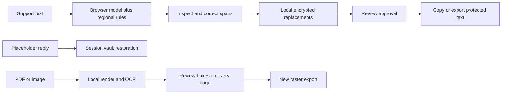

# Independent implementations of a privacy gateway

The upstream source establishes the behavior: detect entities, replace before sharing, keep a reversible local mapping and restore placeholders in a reply. This project reimplements those boundaries in TypeScript and Rust rather than translating the original Python detector line by line. No proprietary binaries or unpublished model weights were recovered.

Browser rule spans use UTF-16 indices. Unicode normalization tracks original offsets instead of redacting normalized text. The model pipeline supplies token words without original offsets, so alignment consumes every token, including non-entities, in order. Unsupported tokens, missing input coverage and model errors block the result. Long messages use overlapping chunks. The English model adds context, but cannot make regional-language accuracy claims.

The browser encrypts mappings with Web Crypto AES-256-GCM and nonextractable keys. HMAC has a separate random key. Tokens carry a random session prefix; reset rotates keys and drops mappings. Restoration performs one pass to avoid recursively expanding token-shaped values. The original input and reviewed span labels remain visible in tab memory until cleared or closed. No localStorage, history database or remote inference is used. Native API masks scan the input for the UI; the browser then handles reviewed replacements.

Rust detects spans in UTF-8 byte offsets, applies replacements on valid boundaries and converts response offsets to UTF-16 for the UI. A loopback-only server verifies exact Host, same Origin when supplied, and a session header on write routes. Errors omit submitted text. Native API replacement scopes have random conversation identifiers, authenticated ciphertext, bounded capacity and a 30-minute lifetime. A caller needs the current server session key and the conversation identifier to restore. This is a single-user local API, not a multi-tenant authorization service. The CLI discards its vault on exit and prints only replacement output and spans.

TypeScript validates phone numbers with libphonenumber and selected IBANs with mod-97. Native Rust phone matching is format-based and does not implement IBAN or spoken-number detection. Rust timing and TypeScript timing therefore measure different detector work; do not interpret their ratio as a programming-language comparison.

Document import renders visible pixels before OCR. Word boxes become regions; manual rectangles catch missed details. Export creates a fresh document from protected pixels, never copies source PDF objects. Every page must be approved. Export guards detect concurrent review changes. The original streams, hidden text, forms, links, attachments and identifying metadata do not carry over. Visible pixels outside selected rectangles remain, including anything detection missed. This sacrifices accessibility and searchable text deliberately; it is not a PDF sanitization guarantee for unreviewed documents.

Downloaded model and OCR assets are pinned and hashed. Their licenses and original authorship are separate from this implementation. Network access is needed for installation; the native-hosted studio's content security policy restricts runtime requests to its own origin. Browser model and OCR workers are terminated on session clear or page exit. Clearing references is not secure memory erasure.
